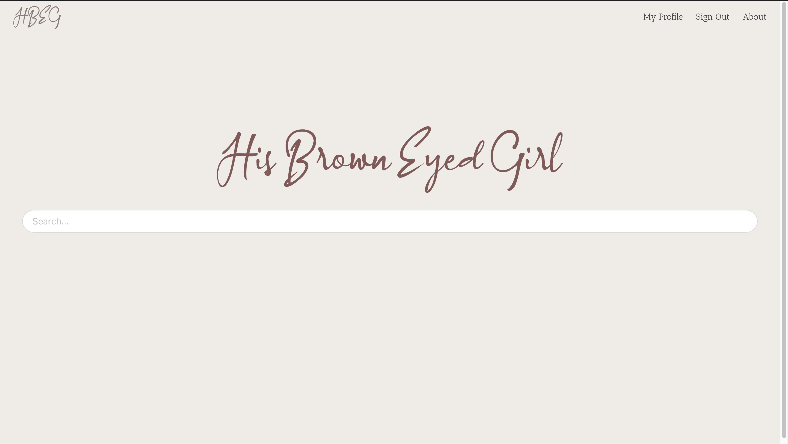

<h1 align="center">His Brown Eyed Girl</h1>

Because you don't need a time machine if you know how to read.

&nbsp;&nbsp;&nbsp;&nbsp;&nbsp;&nbsp;&nbsp;&nbsp;&nbsp;&nbsp;&nbsp;&nbsp;&nbsp;&nbsp;&nbsp;&nbsp;&nbsp;&nbsp;&nbsp;

         

&nbsp;&nbsp;&nbsp;&nbsp;&nbsp;&nbsp;&nbsp;&nbsp;&nbsp;&nbsp;&nbsp;&nbsp;&nbsp;&nbsp;&nbsp;&nbsp;&nbsp;&nbsp;&nbsp;

## About the project
HBEG is *the* web-fiction website with an intelligent search engine to find, help you read, and keep track of every story you read on the internet. 

It began as a hobby project by a couple of voracious Harry Potter fanfiction readers, and it grew to the point that it now sports a unique, intelligent search engineBeta based on all stories from two major websites!

 

 

## Features

HBEG now has a database spanning more than 200K+ stories, and is regularly updated with new stories that pop up on sites. The current list of features include:

* Use the search engine to find stories from fanfiction.net and archiveofourown.org
* Custom profile page and design for every member of the site
* Organise stories into public and hidden folders
* Rate individual stories as per your taste to help others on the site

 

Upcoming features consist of:
<ul id="about-feature-list">
    <li><s>Share your public profile with everyone</s> ✔ </li>
    <li><s>Listing of all stories that you've ever read and rated on the site </s> ✔ </li>
    <li>Refer stories to another member of HBEG</li>
    <li>Get new recommended stories to read straight in your dashboard curated specially for you keeping your reading habits in mind</li>
</ul>

 

## Tech Stack 
1. Django --> Features core of the website
2. PostgreSQL --> Storing the entirety story and user dtabase.
3. Bulma CSS Framework --> For the colour, structure and design
4. sentence-bert, FAISS, Whoosh --> For similarity search engine
5. FastAPI --> For powering the [Eleven API](https://github.com/yashprakash13/Eleven) for the search engine. (If you can guess that reference and why, I'll give you a cookie :wink: )
6. Discord py --> Used for making the [Honeysuckle Discord Bot](https://github.com/yashprakash13/Honeysuckle) bringing some functionalities of the website straight to the discord server
7. Flask and Click --> Featuring in the [Tank CLI](https://github.com/yashprakash13/Tank) for downloading full text content from websites. (If you can guess that reference and why here as well, I'll give you a cookie and a donut :wink: )

 

## Contributing to the community and website

All your contributions are most welcome! 

HBEG is ambitioned to be a community-driven project. As a user of the website, you can:

    <ul id="about-feature-list">
        <li>Contribute new stories that you might have seen pop up on fanfiction.net</li>
        <li>Join the community <a id="about-discord-server-link" target=" _blank" href="https://discord.gg/z87n86uhmy">discord server</a> and offer any suggestions or report any bugs if you found any,</li>
        <li>As a developer, if you're looking to contribute to the project, please come join the <a id="about-discord-server-link" target=" _blank" href="https://discord.gg/z87n86uhmy">discord server</a> so that we can talk about it! It'll be great to have you!</li>
    </ul>

 

## How to use the HBEG search engineBeta 

The search engine is designed to require minimal effort to find a story that you're looking for. Thus, you can <strong>simply search for a story title and you will get the best results that get matched!</strong> 

   

    <strong>Let's take an example.</strong> Say I am searching for a fic titled 'World Changer'. I can simply type and enter: <i>world changer</i> in the search and get what I'm looking for.   

    <u>That's good, but can I search for more than just the title?</u> 

     
    Yes, you can!    Now, let's imagine that I don't remember the whole title of the story. If I only type: 'world', I'll get a multitude of relevant or non-relevant results. I can obviously do a little better. 
    

        With that in mind, here are some simple ways to do a rather specialised search:
        <ul id="about-feature-list">
            <li><strong>Pair search</strong>: If the story that you want comes with a specific ship, then mention it in the search. Like with the previous example, I can type: <i>world harmony</i>, as I know that the story is harmony based.</li>
            <li><strong>Search by author</strong>:If you remember the author's name even partially, just mention it in the search with the prefix <strong>a:</strong>. In the example that we're going with, I know who the author of the story is. So I can search for: <i>world a:arielriddle</i>  or even <i>world harmony a:arielriddle</i>. Any one of them should give me the results that I'm looking for.</li>
            <li><strong>Search by length</strong>:You can also filter stories based on a specific length by using the prefix <strong>l:</strong>. Type <i>l:short</i> for stories less than 50k words, <i>l:medium</i> for stories between 50k to 100k words and <i>l:long</i> for stories of more than 100k words.</li>
            <li>You can <strong>mention a few words of the summary</strong> in the search to narrow down your results even further.</li>
            <li>You can also <strong>specifically search for a fic by summary</strong> by writing: <i>s:</i> followed by a few words of the summary.</li>
        </ul>
    

    
<u> Can I combine the above methods to search?</u> 

     
    Yup! You can also combine any of the above methods or use them individually to browse a general list of stories. For instance, you can use  <i>l:long harmony</i> to get stories greater than 100k words and with the pairing harmony. 
      

    Don't fret if don't find what you're looking for though. The search engine is still developing, and with time, it'll get better at knowing what you want. Until then, well, google isn't going anywhere, and nor are the other readers in the community. Take help if you can, we're all happy to put our minds together in finding an awesome, forgotten story :D. 

